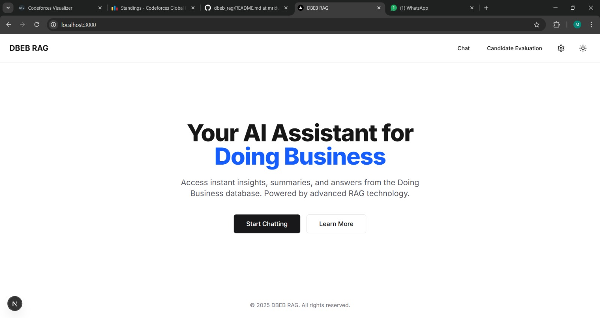
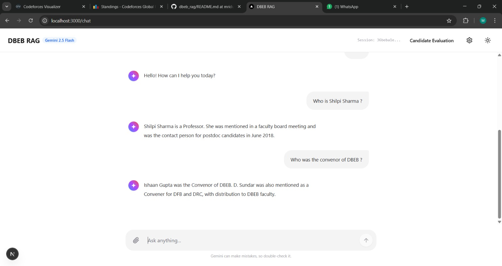
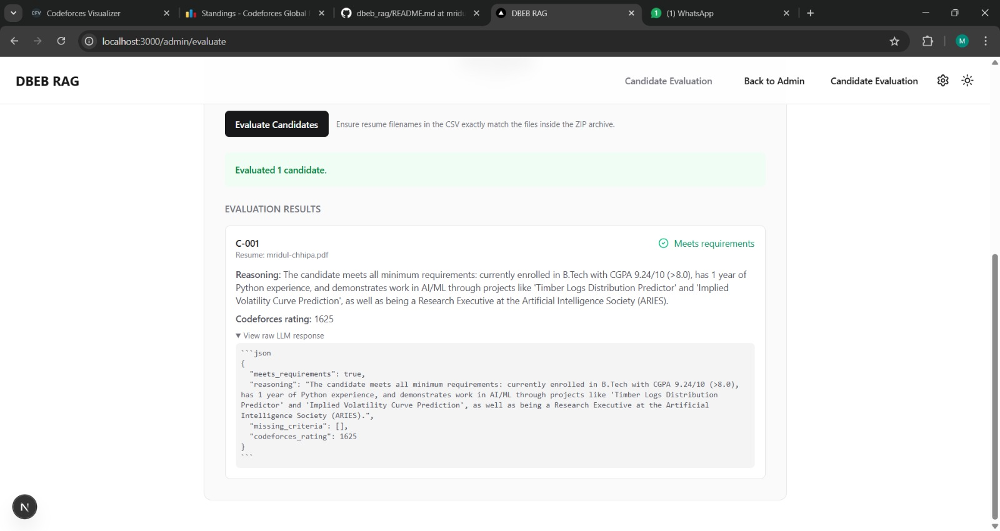
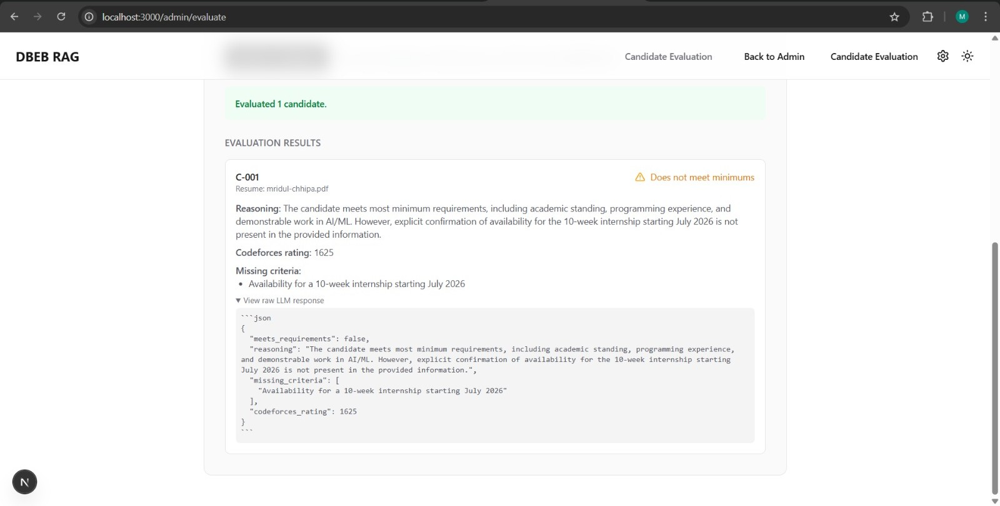
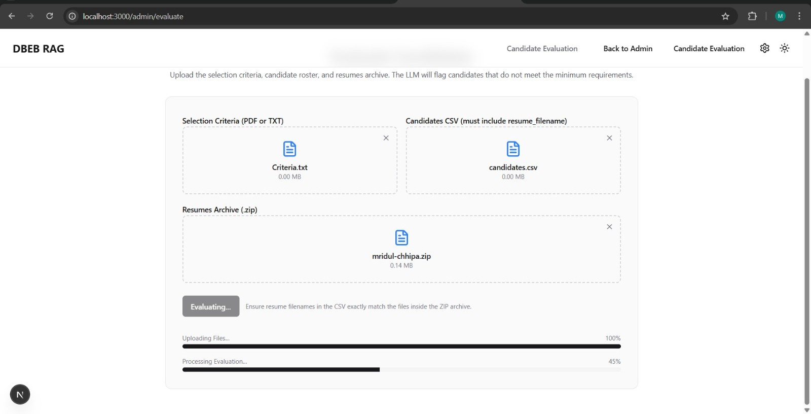
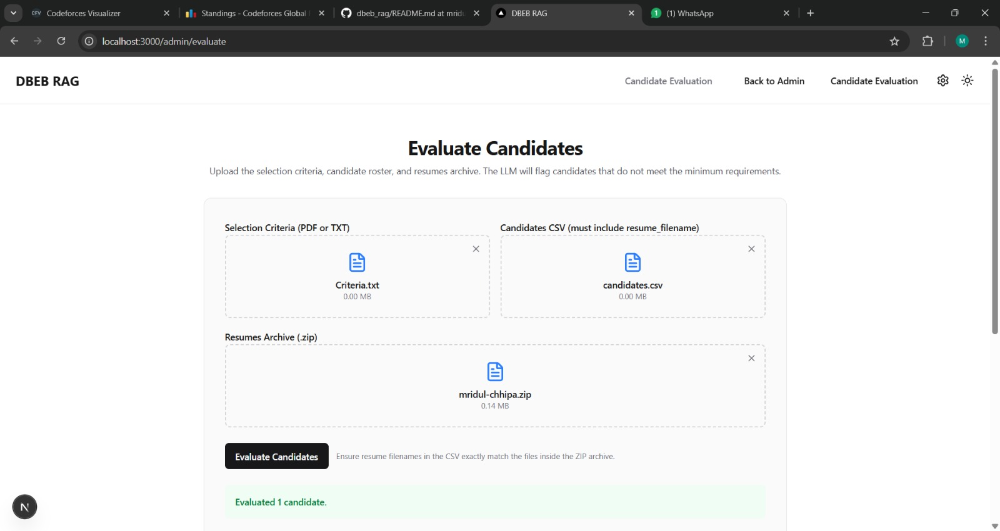
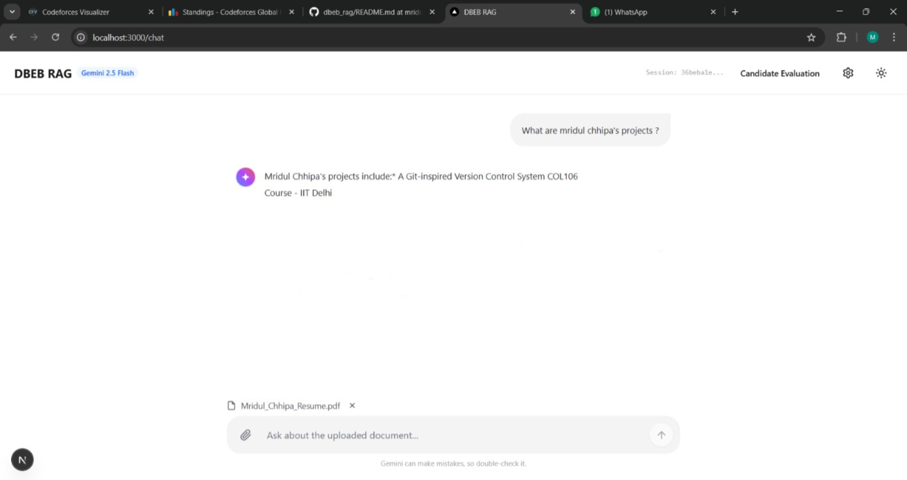
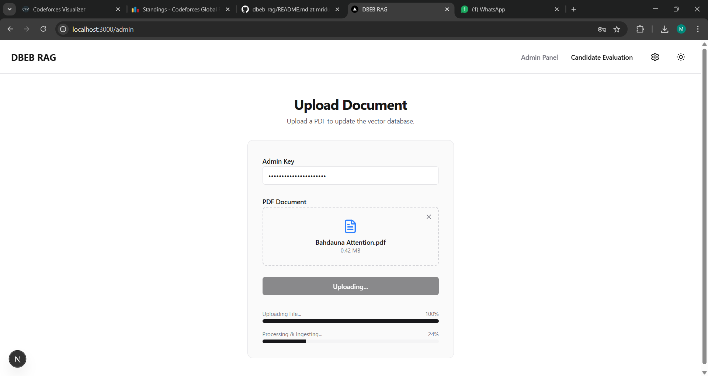

# DBEB

Interactive Retrieval-Augmented Generation (RAG) system built with a FastAPI + LangGraph backend and a Next.js 15 frontend.

## Table of Contents
- [Key Features](#key-features)
- [Project Layout](#project-layout)
- [Screenshots](#screenshots)
- [Requirements](#requirements)
- [Backend Setup](#backend-setup)
- [API Endpoints](#api-endpoints)
- [Candidate Evaluation Pipeline](#candidate-evaluation-pipeline)
- [Frontend Setup](#frontend-setup)
- [Additional Notes](#additional-notes)

## Key Features
- Retrieval-augmented chat with LangGraph orchestration and Gemini Flash responses.
- Streaming document ingestion for both global and per-session knowledge bases backed by Qdrant.
- Dedicated admin workflow for scoring candidate batches with LLM-backed reasoning and Codeforces rating extraction.
- Minimalist Next.js UI with drag-and-drop uploaders, real-time progress bars, and dark mode support.

## Project Layout
- `backend/app/`
	- `main.py`: FastAPI entrypoint (`uvicorn backend.app.main:app`).
	- `api/endpoints.py`: SSE chat stream, admin upload, session upload, and candidate evaluation routes.
	- `services/`: LangGraph graphs, evaluator service, and Qdrant helpers.
	- `core/config.py`: Environment loading (`backend/.env`).
- `dbebui/`: Next.js UI (chat at `/chat`, admin upload at `/admin`, candidate evaluation at `/admin/evaluate`).
- `Dataset_Extractor/`: Utilities for preparing source PDFs.
- `agent.py`: CLI helper for the LangGraph workflow (optional).

## Screenshots

| Home | RAG Demo | Candidate Pass | Candidate Fail |
| --- | --- | --- | --- |
|  |  |  |  |

| Evaluating | Upload UI | Session Uploads | RAG Pipeline |
| --- | --- | --- | --- |
|  |  |  |  |

## Requirements
- Python 3.10+
- Node.js 18+
- Qdrant instance (local or remote). The backend auto-creates collections `dbeb` and `dbeb_sessions` plus payload indexes when it starts.
- Google Generative AI API key with access to Gemini Flash (`GOOGLE_API_KEY`).

## Backend Setup
```bat
cd d:\ARIES\DBEB_RAG\backend
python -m venv .venv
.venv\Scripts\activate
pip install -r ..\requirements.txt
uvicorn backend.app.main:app --reload --port 8000
```

Environment variables are read from `backend/.env`. Minimum keys:
```
GOOGLE_API_KEY=...
ADMIN_KEY=...
QDRANT_URL=http://localhost:6333
QDRANT_API_KEY=
```

## API Endpoints
- `POST /stream` — Streams chat tokens (`event: token|done|sse-error`). Pass `thread_id` to reuse a session.
- `POST /upload` — Admin-only PDF ingestion into the global knowledge base (`X-Admin-Key` header).
- `POST /upload-session` — Uploads a PDF for the active chat session (form fields `file`, `thread_id`). Documents are stored in the temporary `dbeb_sessions` collection using metadata filters.

## Candidate Evaluation Pipeline
- `POST /evaluate-candidates` — Multipart form upload for batch screening. Provide:
	- `criteria`: PDF, TXT, or Markdown describing minimum requirements.
	- `candidates_csv`: CSV containing one row per candidate with a `resume_filename` column (and optional fields such as `candidate_id`, `name`, `email`, etc.).
	- `resumes_zip`: ZIP archive containing the resume files referenced in the CSV. Supported resume formats: PDF, TXT, or Markdown.
- Response: JSON array with each candidate’s pass/fail decision, extracted Codeforces rating, reasoning, and any missing criteria. The backend truncates long resumes automatically and includes the raw LLM payload for auditing.

## Frontend Setup
```bat
cd d:\ARIES\DBEB_RAG\dbebui
npm install
npm run dev
```

Open `http://localhost:3000/chat` to use the chatbot, `http://localhost:3000/admin` for global uploads, and `http://localhost:3000/admin/evaluate` for candidate screening.

## Additional Notes
- The chat UI supports drag-and-drop PDF uploads; the frontend should call `/upload-session` with the current `thread_id` for per-session context.
- Admin and evaluation forms surface dual progress bars: raw upload and downstream processing.
- Console logging is enabled on the backend (`PROMPT TO LLM`, `AGENT NODE MESSAGES`) for debugging. Use environment variables to adjust logging verbosity or swap LLM providers as needed.